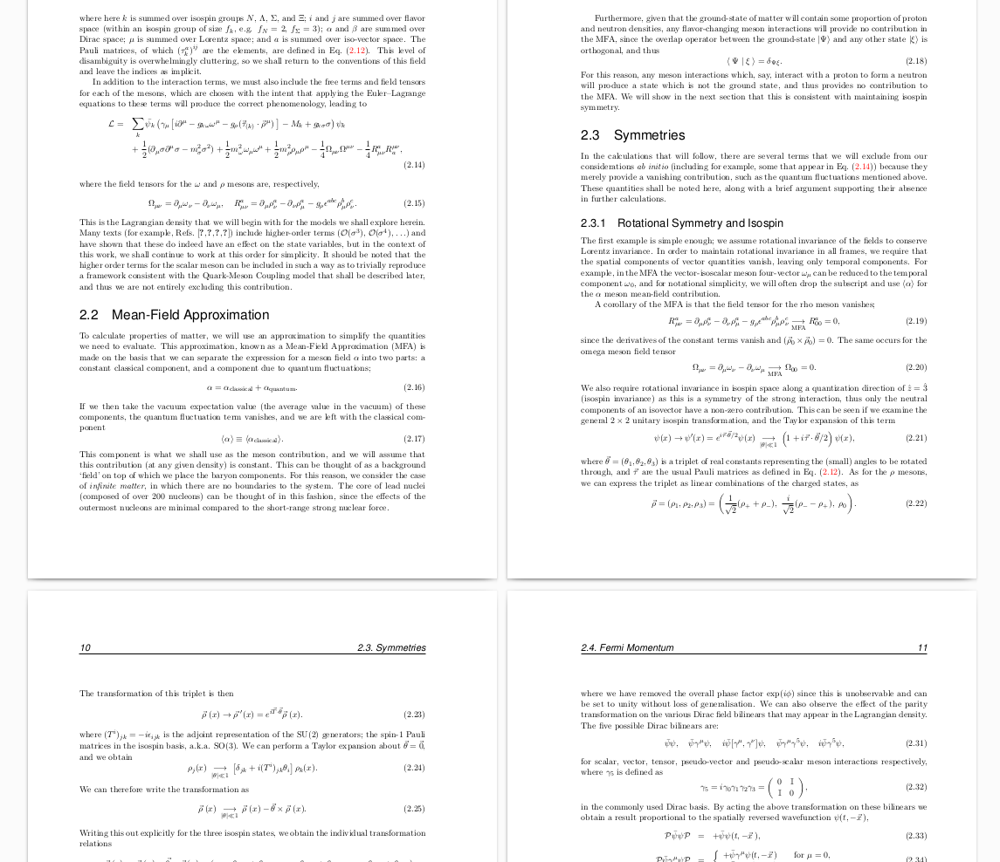

```{r setup, include = FALSE}
knitr::opts_chunk$set(
  collapse = TRUE,
  comment = "#>"
)
```

# Introduction

```{r library}
# install.packages("devtools")
library(TeXCheckR)
```

# Functions of Significance

# Worked Examples

## Source Material

Using a template $\LaTeX$ document would be cheating. Instead we should use a real-world document. One with significance perhaps. To show that I'm not messing around, I'll perform the worked examples using the first two chapters of my own published PhD Thesis, available [here](https://arxiv.org/abs/1001.4318). My University education led me to be a theoretical physicist for a while, so there's bound to be some decent content here to test out these functions. It's also long enough in the past that I am unfazed by any issues I will undoubtedly find with it.

Starting from a download of the [raw source](https://arxiv.org/e-print/1001.4318) (a `.tar.gz` file) stored in a directory, I have combined the preamble with the first two chapters in a file included in this package, removing any graphics for simplicity.

```{r thesis_file}
readLines(carrollthesis <- system.file("extdata", "carrollthesis.tex", package = "TeXCheckR"), n = 6)
```

When compiled (in this case via `tinytex::pdflatex('carrollthesis')`) the result looks like [this](`r system.file("extdata", "carrollthesis.pdf", package = "TeXCheckR")`); 32 pages of equations and text.



## Spell Check

A first thing to do would be to spell-check the source `.tex` file. This works better than simply running spell-check over the input file since that is full of $\LaTeX$ commands which will fail. Testing the thesis source is as simple as

```{r check_spelling, error = TRUE}
check_spelling(carrollthesis)
```

The error here notes that I should have used macros for common abbreviations. Okay; I'll make that change. Alternatively, I could skip over worrying about that with the argument `check_etcs`.

```{r first pass, error = TRUE}
check_spelling(carrollthesis, check_etcs = FALSE)
```

This is something I don't need to fix; it's a font declaration, not prose. I can tell `check_spelling()` to ignore a pattern 

```{r ignore a pattern, error = TRUE}
check_spelling(carrollthesis, check_etcs = FALSE, known.correct = "cmr")
```

This one is unsurprising. The word is correct, but you won't find it in every dictionary. Indeed

```{r hadrodynamics, error = TRUE}
hunspell::hunspell_check("hadrodynamics")
```

We can add this to our 'known correct' list

```{r add to known correct, error = TRUE}
check_spelling(carrollthesis, check_etcs = FALSE, known.correct = c("cmr", "Hadrodynamics"))
```

This is an acronym, so it is also not surprising that it fails a spell-check. Add it to the list. For now I'll just provide a long list of words which are correct.

```{r lots of known correct, error = TRUE}
known_correct <- c("cmr",
                   "QHD", "QMC", "QED",
                   "Hadrodynamics", "defense", "Hitchhiker", 
                   "perturbative", "perturbatively", "endeavor",
                   "wavefunction",
                   "Baade", "Zwicky", "Pauli", "Chandrasekhar")
check_spelling(carrollthesis, check_etcs = FALSE, known.correct = known_correct)
```

This is perhaps undesired, but the umlauts in this word trip up the spellcheck, so we add this to the list, plus more and more

```{r lots of known correct with umlaut words, error = TRUE}
known_correct <- c("cmr", "Eq", "Refs", "rcrcrcl",
                   "QHD", "QMC", "QED", "MFA", 
                   "Hadrodynamics", "defense", "Hitchhiker", 
                   "perturbative", "perturbatively", "endeavor",
                   "disambiguity", 
                   "wavefunction", "spinors", "u", "ip", "antibaryons", 
                   "isoscalar", "isovector", "ig", "ij", "flavor", "iso",
                   "contravariant", "bilinears", "abc", "jk", "fm", "unitless",
                   "Baade", "Zwicky", "Pauli", "Chandrasekhar", "Minkoswki", "Yukawa", "Fock", "Hartree", 
                   "na", "ively")
check_spelling(carrollthesis, check_etcs = FALSE, known.correct = known_correct)
```

Well that's embarrassing... it should of course be ab init_i_o; a genuine typo. We can add that to a list of lines to ignore after checking that it is otherwise okay

```{r a known wrong example, error = TRUE}
known_correct <- c("cmr", "Eq", "Refs", "rcrcrcl",
                   "QHD", "QMC", "QED", "MFA",
                   "Hadrodynamics", "defense", "Hitchhiker",
                   "perturbative", "perturbatively", "endeavor",
                   "disambiguity", 
                   "wavefunction", "spinors", "u", "ip", "antibaryons",
                   "isoscalar", "isovector", "ig", "ij", "flavor", "iso",
                   "contravariant", "bilinears", "abc", "jk", "fm", "unitless",
                   "Baade", "Zwicky", "Pauli", "Chandrasekhar", "Minkoswki", "Yukawa", "Fock", "Hartree", 
                   "na", "ively")

## the offending line
readLines(carrollthesis)[1161]

## ignore that
ignore_lines <- c(1161)

check_spelling(carrollthesis, check_etcs = FALSE, known.correct = known_correct, ignore.lines = ignore_lines)
```

Continuing on, another genuine error arises

```{r neccesary}
readLines(carrollthesis)[1261]
hunspell::hunspell_check("neccesary")
```

So we also ignore this line

```{r more known corrects}
known_correct <- c("cmr",  "rcrcrcl", "cccc", "rcrcr", ## commands
                   "Eq", "Eqs", "Refs", ## references
                   "QHD", "QMC", "QED", "MFA", "DCSB", "DSE", ## acronyms
                   "Hadrodynamics", "defense", "Hitchhiker", ## unusual words
                   "perturbative", "perturbatively", "endeavor",
                   "disambiguity", "extremum", 
                   "wavefunction", "spinors", "antibaryons",  "hadronic", ## physics terms
                   "isoscalar", "isovector",  "flavor", "iso", "color", 
                   "anticommutation", "renormalization", "contravariant", 
                   "bilinears", "unitless", "gluonic", "isochemical",
                   "abc", "jk", "fm","aG", "gA", "ig", "ij", "u", "ip", ## math
                   "gf", "iS", "iD", "DV", "DS", "PdV", "BM", "dk", 
                   "dS", "dV", "dN", "TdS", "dE", "BB", "Bm",
                   "sym", "diag",  "MeV", 
                   "Baade", "Zwicky", "Pauli", "Chandrasekhar", "Minkoswki", "Yukawa", ## names
                   "Fock", "Hartree", "Gell", "Mann", "Noether", "Goldstone", "Schwinger",
                   "na", "ively") ## contain accents
ignore_lines <- c(1161, 1261)

check_spelling(carrollthesis, check_etcs = FALSE, known.correct = known_correct, ignore.lines = ignore_lines)
```

Eventually, we get **no** errors produced, signalling that the check is finally complete.

Some of these words were simply US spellings; e.g. `flavor`, `color`, `endeavor`. The first two of these refer to specific physics terms (quantum numbers) so I've deferred to the US spelling for them for consistency. If we wish to specify the dictionary language in `check_spelling()` then we can do that with the `dict_lang` argument

```{r, error = TRUE}
known_correct <- c("cmr",  "rcrcrcl", "cccc", "rcrcr", ## commands
                   "Eq", "Eqs", "Refs", ## references
                   "QHD", "QMC", "QED", "MFA", "DCSB", "DSE", ## acronyms
                   "Hadrodynamics", "Hitchhiker", ## unusual words
                   "perturbative", "perturbatively",
                   "disambiguity", "extremum", 
                   "wavefunction", "spinors", "antibaryons",  "hadronic", ## physics terms
                   "isoscalar", "isovector",  "iso",  
                   "anticommutation", "renormalization", "contravariant", 
                   "bilinears", "unitless", "gluonic", "isochemical",
                   "abc", "jk", "fm","aG", "gA", "ig", "ij", "u", "ip", ## math
                   "gf", "iS", "iD", "DV", "DS", "PdV", "BM", "dk", 
                   "dS", "dV", "dN", "TdS", "dE", "BB", "Bm",
                   "sym", "diag",  "MeV", 
                   "Baade", "Zwicky", "Pauli", "Chandrasekhar", "Minkoswki", "Yukawa", ## names
                   "Fock", "Hartree", "Gell", "Mann", "Noether", "Goldstone", "Schwinger",
                   "na", "ively") ## contain accents
## removed "defense",  "endeavor", "flavor", "color"
ignore_lines <- c(1161, 1261)

check_spelling(carrollthesis, check_etcs = FALSE, known.correct = known_correct, ignore.lines = ignore_lines, dict_lang = "en_US")
```

Interestingly enough, "hyperon" is a word in the `en_GB` dictionary but not the `en_US` one, go figure

```{r}
hunspell::hunspell_check("hyperon", dict = "en_GB")
hunspell::hunspell_check("hyperon", dict = "en_US")
```

Adding this plus some other examples, we again reach an error-free state

```{r}
US_specific_known_correct <- c("hyperon", "favourable", "favourite", "precisions", "electro", "Chromodynamics", "QCD", "Regularisation", "chiral", "utilise", "fermions", "gravitationally", "muons", "SNR", "centre", "hadrons", "antiquark", "isospin", "spinor", "Adjoint", "initio", "notational", "quantization", "adjoint", "SU", "eigenstate", "unobservable", "generalisation", "fermion", "massless", "Hermitian", "fermionic", "renormalized", "covariant", "pion", "boson", "thermodynamically", "unphysical", "isentropic", "isothermal")
all_known_correct <- c(known_correct, US_specific_known_correct)
check_spelling(carrollthesis, check_etcs = FALSE, known.correct = all_known_correct, ignore.lines = ignore_lines, dict_lang = "en_US")
```

A lot of these are physics-specific words, though it's perhaps odd that they are in one dictionary and not the other

```{r}
table(hunspell::hunspell_check(US_specific_known_correct, dict = "en_GB"))
table(hunspell::hunspell_check(US_specific_known_correct, dict = "en_US"))
```

Using `rstudio = TRUE` we can even have RStudio open the file at the relevant place.

## Meta Information

`commands_used()` can extract all commands used in a document. Lots of physics here (custom commands a plenty)

```{r list commands used}
commands_used(readr::read_lines(carrollthesis))
```

<!-- ## Splitting into Smaller Pieces -->

<!-- The source file attached was assembled by pasting together a preamble with two chapter files. Originally these were `\include`d. To go back to this state, we can split the source at chapter definitions -->

<!-- ```{r split at chapter} -->
<!-- tmpTex <- tempfile(fileext = ".tex") -->
<!-- tmpdir <- tempdir() -->
<!-- split_report(carrollthesis, subdir = tmpdir) -->
<!-- ``` -->

<!-- ## Checking for Consecutive words -->

<!-- ```{r consecutive words} -->
<!-- check_consecutive_words(path = sub("carrollthesis.tex", "", carrollthesis), latex_file = "carrollthesis.tex") -->
<!-- ``` -->

